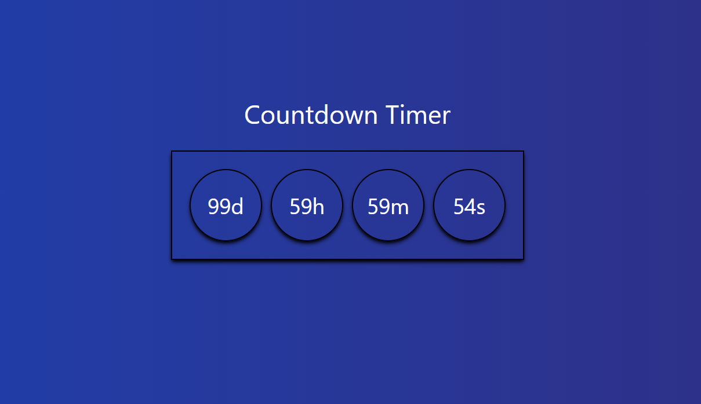

# ⏳ Countdown Timer

A simple and visually appealing countdown timer built with **React**. watch the timer count down in days, hours, minutes, and seconds.

 <!-- Replace this with an actual screenshot of your project -->

## 🌟 Features

- Displays remaining time in **days**, **hours**, **minutes**, and **seconds**
- **Real-time** updates every second
- Adjustable for any duration

## 🚀 Installation

1. **Clone** the repository:
   ```bash
   git clone https://github.com/SyedShahulAhmed/React-Projects.git
   cd countdown-timer
   ```

2. **Install dependencies**:
   ```bash
   npm install
   ```

3. **Run the app**:
   ```bash
   npm run dev
   ```

## 🛠️ Usage

- Start the timer by setting the `duration` in milliseconds (e.g., `100 * 24 * 60 * 60 * 1000` for a 100-day timer).
- The countdown will start automatically upon rendering and update every second.
