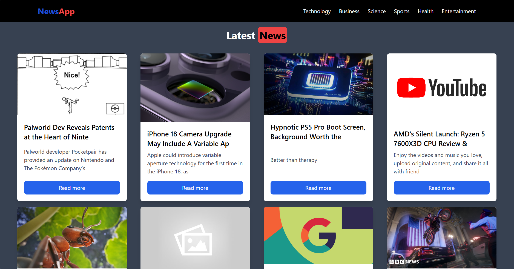

# 🌐 News App

A simple news application built with React that fetches the latest articles from various categories using the [News API](https://newsapi.org/).



## 🚀 Features

- 📰 Displays the latest news from multiple categories.
- 📱 Responsive design with a mobile-friendly navbar.
- 🔍 Category selection for tailored news.

## ⚙️ Installation

1. Clone the repository:
    ```bash
    git clone https://github.com/SHAHUL-AHMED-77/React-Projects.git
    ```

2. Install dependencies:
    ```bash
    npm install
    ```

3. Run the app:
    ```bash
    npm run dev
    ```

Your app will be live at [http://localhost:3000](http://localhost:3000). 🚀


