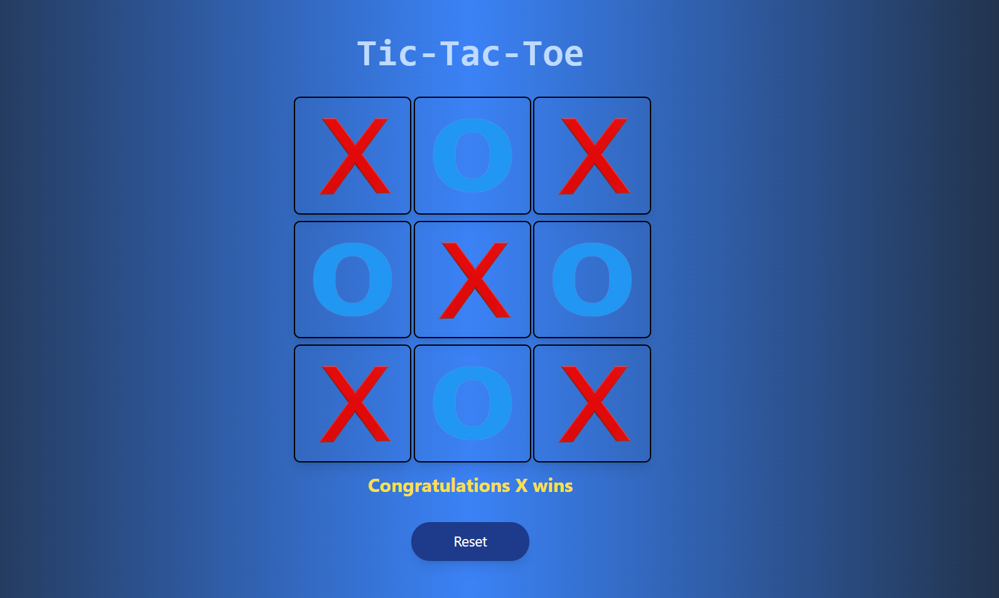

# Tic-Tac-Toe Game

This is a simple Tic-Tac-Toe game built with React. Players can take turns as **X** and **O** until one of them wins or the game ends in a draw. 

## 🎮 Preview

### 🧩 **Game in Action**

Below is a preview of the game in action. Players can click on the cells to make their move. The game will detect and display the winner or show a draw.



### 🔄 **Reset Functionality**

After a game is completed, you can click the **Reset** button to start a new game. This allows you to play multiple rounds without needing to reload the page.

## Features

- **Interactive Gameplay**: Click on cells to place X or O.
- **Winning Logic**: Checks for winning combinations after each move.
- **Reset Functionality**: Start a new game with the Reset button.

## Installation

1. Clone the repository:
   ```bash
   git clone https://github.com/SHAHUL-AHMED-77/React-Projects.git
   ```
2. Navigate into the project folder:
   ```bash
   cd tic-tac-toe-game
   ```
3. Install the dependencies:
   ```bash
   npm install
   ```

## Usage

Run the development server:
```bash
npm run dev
```

Navigate to `http://localhost:3000` to start playing the game.

## Code Overview

### `Game` Component

- **State Management**: Uses `useState` to manage board state and turn tracking.
- **Click Handling**: Calls `handleClick` to mark X or O, and `checkwin` to check if there’s a winner.
- **Reset Button**: Resets the game board when clicked.
