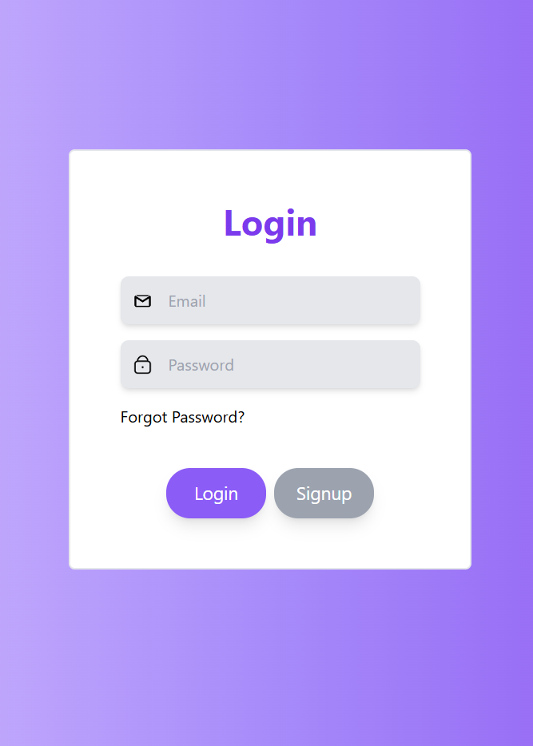
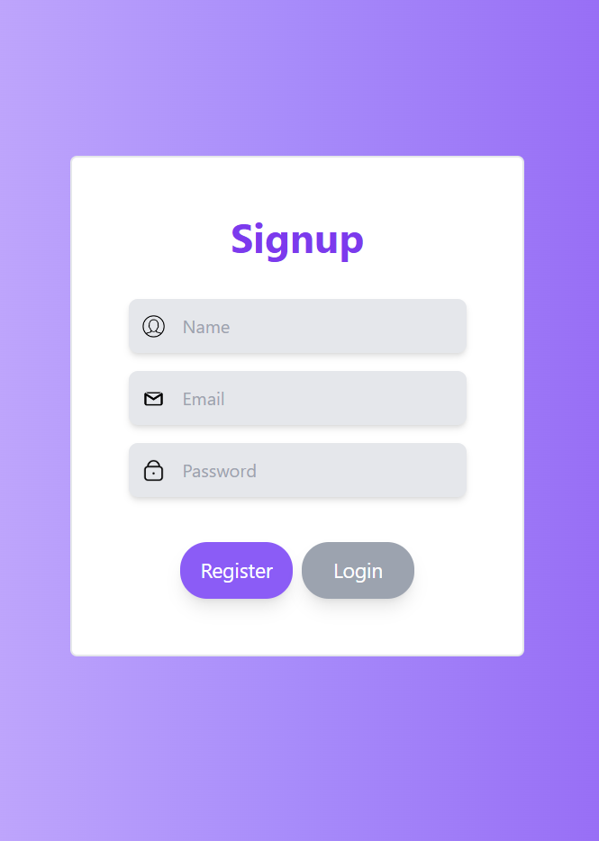

# 🎉 Login & Signup Component 🎉

Welcome to the **Login & Signup** component built with React! This component provides a sleek and responsive UI that lets users toggle effortlessly between login and signup forms. Featuring a gradient background, user-friendly inputs, and mobile-friendly design, this component is easy to integrate and customize for various applications.

## 🌟 Preview

| **Login Screen**                                | **Signup Screen**                               |
|-------------------------------------------------|-------------------------------------------------|
|             |           |

## 🚀 Features

- 🔄 **Dynamic Form Toggle**: Switch between Login and Signup with a single click.
- 🎨 **Gradient Background**: Eye-catching gradient adds a modern feel to the UI.
- 📱 **Responsive Design**: Optimized for all devices, from desktop to mobile.
- 🔑 **Forgot Password Option**: Link provided for easy password recovery.
- ✨ **User-Friendly Inputs**: Clear placeholders and accessible form design for a smooth user experience.

## ⚙️ Installation

1. Clone the repository:
   ```bash
   git clone https://github.com/SHAHUL-AHMED-77/React-Projects.git
   ```
2. Navigate into the project folder:
   ```bash
   cd RegisterForm
   ```
3. Install the dependencies:
   ```bash
   npm install
   ```

## 🖥️ Usage

Start the development server:

```bash
npm run dev
```

Navigate to `http://localhost:3000` to view the component in your browser and start exploring!

## 📁 Project Structure

- **Components**: Organized into separate components for user icons, input fields, and toggle buttons.
- **Styling**: Uses Tailwind CSS classes for a beautiful gradient, spacing, and rounded corners.
- **State Management**: React `useState` manages form toggle and conditional rendering for login and signup forms.

## 🎨 Customization

This component is fully customizable! Adjust colors, placeholders, and add form fields to fit your needs. Update assets in the `assets` folder to use your own icons for user, email, and password fields.

