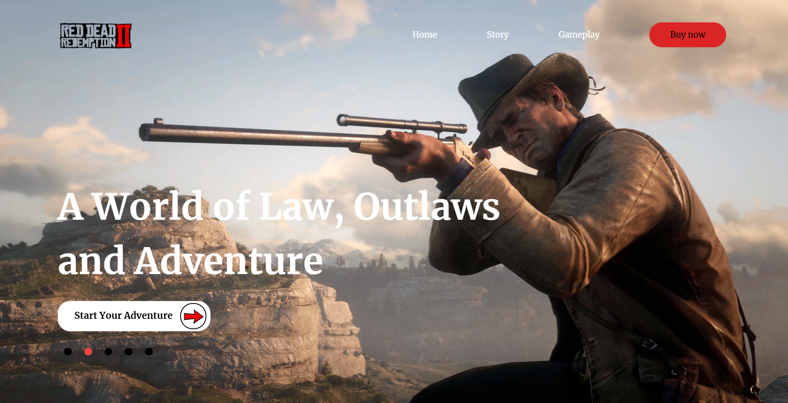
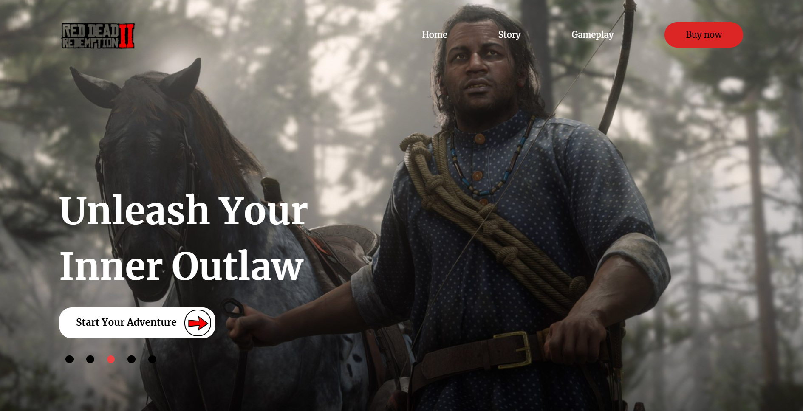
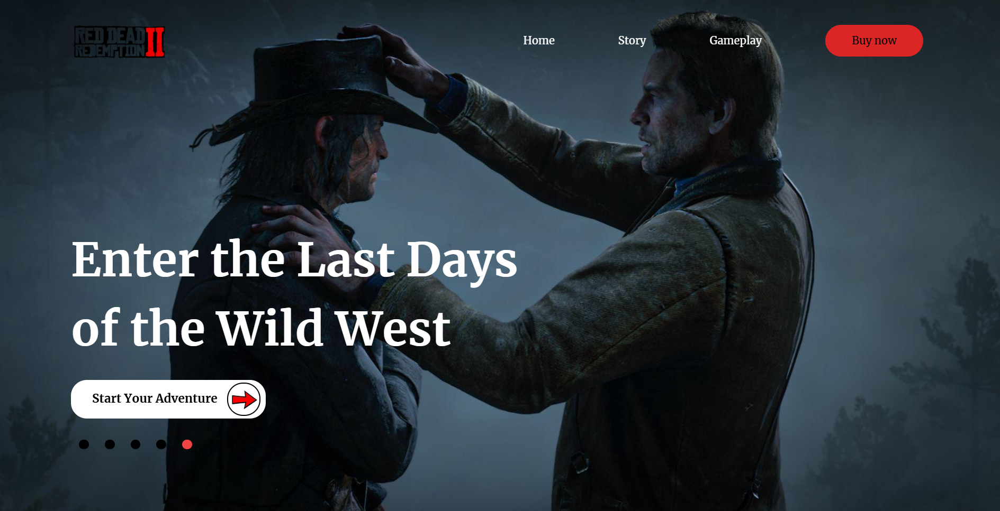

# 🌵 Red Dead Redemption 2 Website

This project is a web application built with **React**, showcasing different scenes from *Red Dead Redemption 2*. The background images and hero text change every 5 seconds, creating an immersive experience. 🚨

## 🌟 Preview

Here are previews of the first three background images that cycle through on the homepage:

1. **Image 1**  
   

2. **Image 2**  
   

3. **Image 3**  
   

## 🚀 Features

- **Dynamic Backgrounds**: 🌄 The background images change every 5 seconds, displaying different scenes from *Red Dead Redemption 2*.
- **Hero Text**: 💬 The text content changes dynamically, providing contextual information related to the game.
- **Interactive Navigation**: Use clickable elements to navigate between different scenes.
  
## 🛠️ Installation

To run this project locally, follow these steps:

1. Clone the repository:

   ```bash
   git clone https://github.com/SyedShahulAhmed/React-Projects.git
   ```

2. Navigate into the project directory:

   ```bash
   cd RDR-2
   ```

3. Install the dependencies:

   ```bash
   npm install
   ```

4. Start the development server:

   ```bash
   npm run dev
   ```

   This will open the application in your default browser at `http://localhost:3000`. 🌐

## ⚙️ How It Works

The app is built using **React** with the following structure:

- **App**: 🏠 The main component contains the state for controlling the background image and text content. It uses `setInterval` to update the background and text every 5 seconds.
- **Navbar**: 📑 A simple navbar that can be extended with additional features or links.
- **Hero**: 💪 Displays dynamic hero text that changes with the background.
- **Background**: 🖼️ Displays the dynamic background images based on the `heroCount` state.

## 🖥️ Technologies Used

- **React**: ⚛️ JavaScript library for building user interfaces.
- **CSS**: 🎨 For styling and ensuring a responsive design.
- **JavaScript**: 💻 For handling dynamic state changes, like cycling through the background images and hero text.

## 🎮 Acknowledgments

- *Red Dead Redemption 2* is a trademark of **Rockstar Games**. All images used in this project are property of Rockstar Games. 🎮
- Thanks to **React** for making the development process smooth and efficient. 🚀
