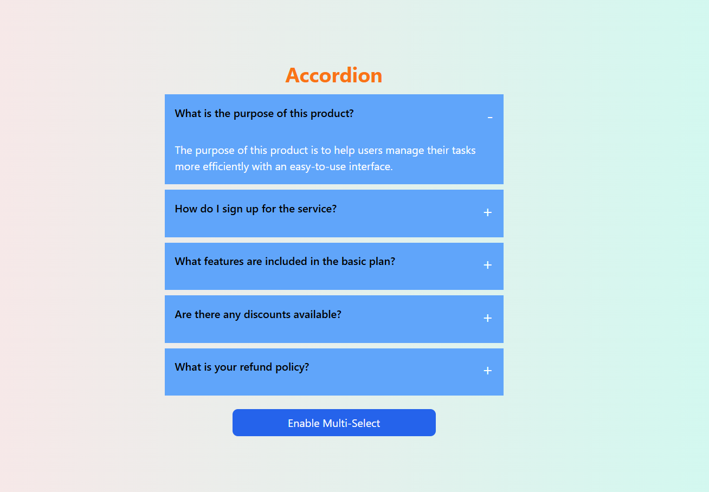
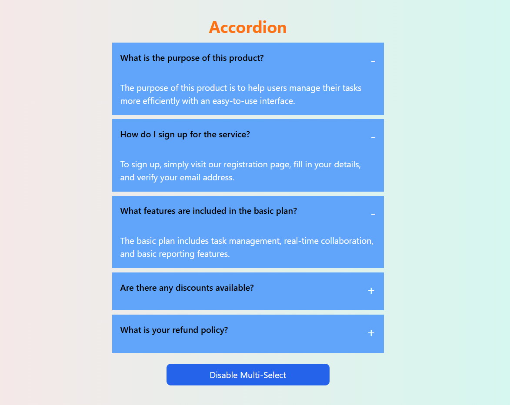

# 🎛️ Accordion Component

An interactive and customizable Accordion component built with React and JavaScript! Perfect for FAQ sections, Q&A displays, or organizing expandable content on your webpage.

## ✨ Features

- 🔒 **Single Selection Mode**: Only one section can be open at a time.
- 🔓 **Multi-Selection Mode**: Allows multiple sections to be open simultaneously.
- ➕➖ **Dynamic Icons**: Toggles between "+" and "-" based on the section's state.

---

## 📸 Preview

#### Single-Selection Mode
In this mode, only one section of the Accordion can be open at any time.

#### Multi-Selection Mode
Allows multiple sections to be open at once, providing more flexibility in displaying content.

## 🚀 Getting Started

1. **Clone the Repository**:
   Follow the instructions to clone and set up the repository.

2. **Customizable Data**:
   Use any JSON format to populate the Accordion content with your question-answer pairs.

## 📚 Usage

This Accordion component is reusable and highly customizable. Feel free to integrate it into your project and style it further to match your application’s theme.

---

Contributions and suggestions are welcome! 😊  the images should be only in one row and two columns