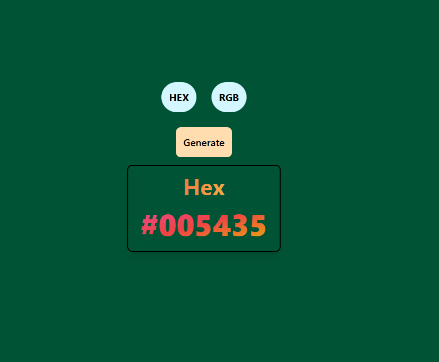
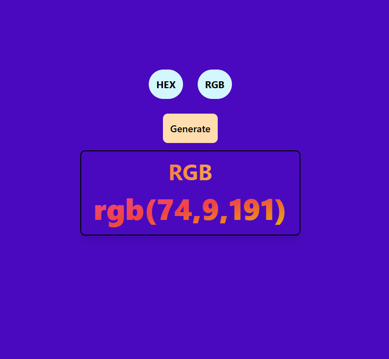

# 🎨 **Color Generator**

A simple React app that allows users to switch between HEX and RGB color formats and generates random colors in the selected format. The background of the app changes dynamically based on the generated color.

## 🚀 Features
- 🔲 Toggle between **HEX** and **RGB** color formats.
- 🎨 Generate random colors in the selected format.
- 🌈 Background color changes with each color generation.

## 📸 Demo

| **HEX Mode**                                    | **RGB Mode**                                   |
|--------------------------------------------------|-------------------------------------------------|
|  |  |

## 🛠️ Installation

1. Clone the repository:
   ```bash
   git clone https://github.com/SHAHUL-AHMED-77/React-Projects.git
   ```
2. Navigate to the project folder:
   ```bash
   cd ColorGenerator
   ```
3. Install dependencies:
   ```bash
   npm install
   ```
4. Start the app:
   ```bash
   npm run dev
   ```

## 🖱️ Usage
- **HEX Button**: Click to set the color format to HEX.
- **RGB Button**: Click to set the color format to RGB.
- **Generate Button**: Click to generate a new random color in the selected format.

## 💻 Code Overview

### `Color` Component
- `Type` state determines the selected color format (either HEX or RGB).
- `color` state holds the current background color value.
- `GenerateHex` and `GenerateRgb` functions create random color values in HEX or RGB formats and update the `color` state.
