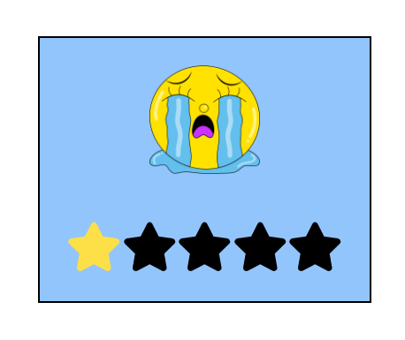
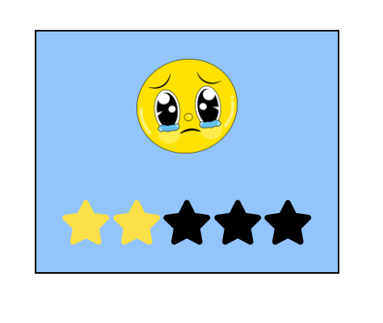
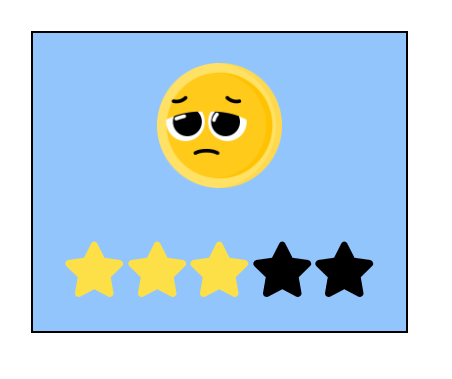
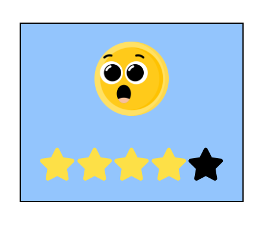

# 🌟 Star Rating with Emoji Feedback 🐼

This is a React app that allows users to rate with stars, and it shows an emoji based on the rating or hover state. The background color and emoji change dynamically based on user interaction.

## Features

- ⭐ Interactive star rating system.
- 😊 Emoji feedback displayed based on hover or rating.
- 👆 Click to rate, and hover to preview emoji feedback.
- 🎨 Dynamic background color change based on rating.

## Preview

| **Default**                            | **Rating -1**                            | **Rating -2**                            |
|-------------------------------------------------|-------------------------------------------------|-------------------------------------------------|
|  |  |  |
| **Rating -3**                            | **Rating -4**                            | **Rating -5**                            |
|  |  |  |

## Installation ⚙️

1. Clone the repository:
   ```bash
   git clone https://github.com/SyedShahulAhmed/React-Projects.git
   ```

2. Navigate to the project folder:
   ```bash
   cd StarRating
   ```

3. Install dependencies:
   ```bash
   npm install
   ```

4. Start the app:
   ```bash
   npm run dev
   ```

## Usage 🚀

1. ⭐ Hover over the stars to preview the emoji feedback.
2. 👆 Click on the stars to rate and display the corresponding emoji.
3. 🎨 The background color changes dynamically based on your rating.

## Technologies Used 🧰

- ⚛️ React.js
- 🔧 React Icons
- 🌈 Tailwind CSS
- 💻 JavaScript

## Contributing 🤝

Feel free to fork this project and make improvements. If you find any bugs or have suggestions, open an issue or submit a pull request. 
