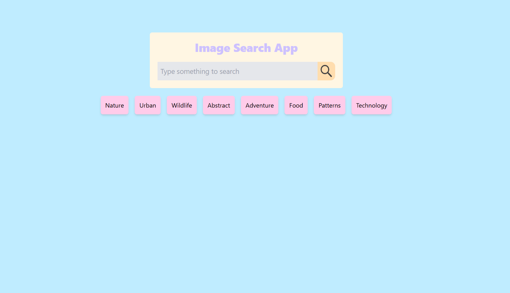
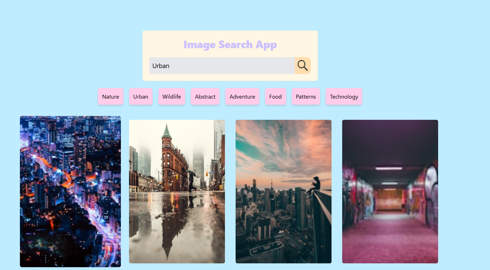
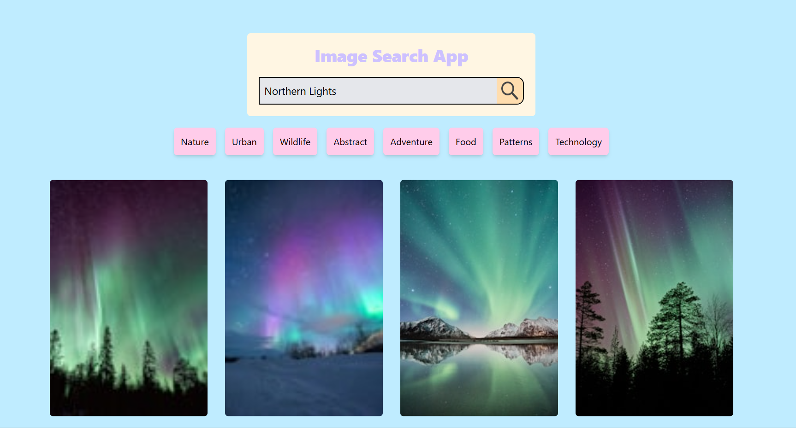

# 🌟 Image Search App 📸

A simple and elegant Image Search App built with React that allows users to search for images by keywords and explore a range of popular categories. It leverages the Unsplash API to fetch high-quality images based on user queries and displays them in a responsive grid format.

## 🌈 Features
- 🔍 **Keyword Search**: Enter a keyword to search for related images from Unsplash.
- 🎨 **Popular Categories**: Quick filters to search for pre-defined categories like Nature, Urban, Wildlife, and more!
- 📱 **Responsive Design**: The image grid adjusts to different screen sizes for an optimal viewing experience.

## 🖼️ Demo

Here are some screenshots of the app in action:

<div align="center">
  
  
  
  
</div>

## ⚙️ Installation

1. Clone the repository:
   ```bash
   git clone https://github.com/SHAHUL-AHMED-77/React-Projects.git
   cd image-search-app
   ```

2. Install the dependencies:
   ```bash
   npm install
   ```

## 🚀 Usage

1. **Start the Application**:
   ```bash
   npm run dev
   ```
   The app should now be running on `http://localhost:3000`.

2. **Search for Images**:
   - 🔤 Enter a keyword in the search bar to find specific images.
   - ⚡ Click on one of the popular categories (e.g., Nature, Urban, Wildlife) for quick access to themed images.

## 🔑 API Key Setup

This app uses the [Unsplash API](https://unsplash.com/developers) to fetch images. You need an API key to access it:

1. 📝 Sign up for a free account at [Unsplash](https://unsplash.com).
2. 🌐 Go to the [Unsplash Developers page](https://unsplash.com/developers) and create a new application to obtain an API key.
3. Add your API key to a `.env` file in the root of the project:
   ```plaintext
   VITE_API_KEY=your_unsplash_api_key_here
   ```
4. 🔄 Restart the development server after saving the `.env` file.

## 🛠️ Technologies Used
- **React** - for building the user interface.
- **Unsplash API** - for accessing a vast library of free images.
- **Tailwind CSS** - for easy and responsive styling.
- **JavaScript (ES6)** - for app logic and functionality.

## 💖 Acknowledgments
- 📷 [Unsplash](https://unsplash.com) for their free and high-quality images.
- 🎨 [Tailwind CSS](https://tailwindcss.com) for easy-to-use utility classes.

---

Enjoy exploring beautiful images with the **Image Search App**! 🌍✨