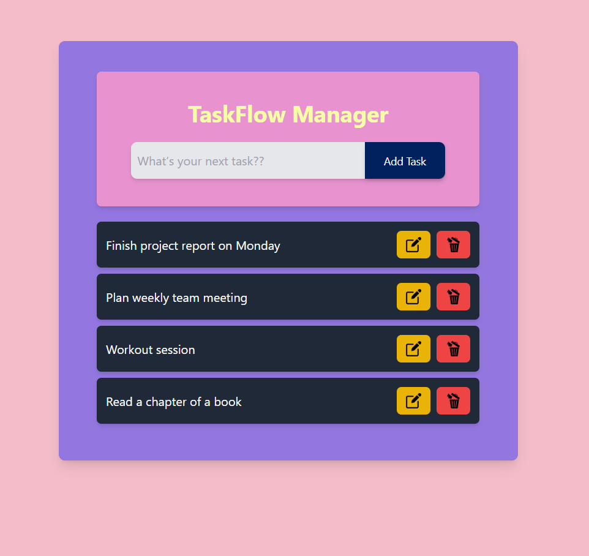

# 🌟 TaskFlow Manager 🌟

**TaskFlow Manager** is a sleek, professional, and responsive Todo App built with **React**. It allows users to easily add, edit, and delete tasks, helping to streamline and manage daily activities effectively. The app is styled with **Tailwind CSS** for a modern look and smooth user experience.

---

## ✨ Features

- 📝 **Add Tasks**: Add new tasks by typing into the input field and clicking the **"Add Task"** button.
- ✏️ **Edit Tasks**: Update existing tasks with the **"Edit"** button.
- 🗑️ **Delete Tasks**: Instantly remove tasks by clicking the **"Delete"** button.

---

## 🚀 Demo

Here are some screenshots of TaskFlow Manager in action:

<div align="center">
  <h4>1. Adding a New Task 📝</h4>
  
  
  <h4>2. Updating an Existing Task ✏️</h4>
  
  
  <h4>3. Deleting a Task 🗑️</h4>
  
</div>

---

## 🛠️ Installation

1. **Clone the repository**:
   ```bash
   git clone https://github.com/SyedShahulAhmed/React-Projects.git
   cd TaskFlow-Manager
   ```

2. **Install dependencies**:
   ```bash
   npm install
   ```

3. **Start the application**:
   ```bash
   npm run dev
   ```
   The app should now be running on [http://localhost:3000](http://localhost:3000) 🚀.

---

## 📚 Usage

1. **Add Tasks**: Type your task in the input field and click **"Add Task"**.
2. **Edit Tasks**: Click the ✏️ edit button next to a task, update the text in the input field, and click **"Update Task"** to save.
3. **Delete Tasks**: Click the 🗑️ delete button to remove a task from the list.

---

## 💻 Technologies Used

- ⚛️ **React** - Frontend framework for building interactive user interfaces.
- 🎨 **Tailwind CSS** - Utility-first CSS framework for quick and responsive styling.
- 📜 **JavaScript (ES6)** - For app functionality.

---

Enjoy using **TaskFlow Manager**! 🎉 If you have any suggestions or issues, feel free to open an **issue** or submit a **pull request**. Happy task managing! ✨