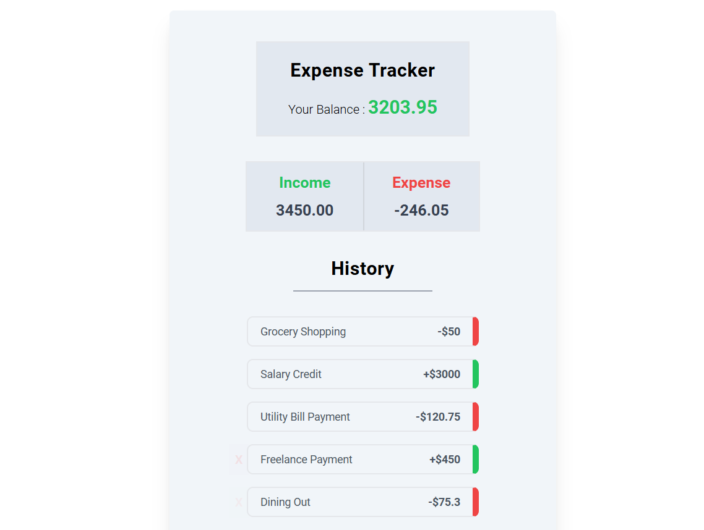
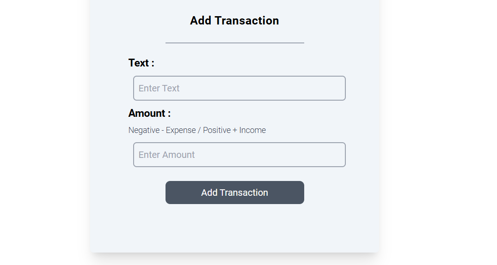

# Expense Tracker 💰  

A modern and responsive **Expense Tracker** web application built with **React** and **Tailwind CSS**. This project helps users keep track of their income and expenses while providing a detailed transaction history.  

## Features ✨  
- **Add Transactions**: Easily add income or expense entries.  
- **Track Balances**: Keep an updated record of your current balance.  
- **Detailed Expense & Income Breakdown**: View total income and expense values at a glance.  
- **Transaction History**: A list of all transactions with clear labels for income and expenses.  
- **Responsive Design**: Fully optimized for all device sizes (mobile, tablet, and desktop).  

## Preview 🖼️  

### Tracker Overview  
  
*Visual representation of your current balance, income, and expenses.*  


### Add New Transaction  
  
*Simple interface to quickly add income or expense entries.*  

## Tech Stack 🛠️  
- **React.js**: For building dynamic, reusable UI components.  
- **Tailwind CSS**: For fast and responsive styling.  
- **Context API**: For global state management across the app.  

## How to Run the Project 🚀  
1. Clone the repository:  
   ```bash  
   git clone https://github.com/SyedShahulAhmed/React-Projects.git  
   ```  
2. Navigate to the project folder:  
   ```bash  
   cd ExpenseTracker  
   ```  
3. Install dependencies:  
   ```bash  
   npm install  
   ```  
4. Start the development server:  
   ```bash  
   npm run dev  
   ```  
5. Open your browser and navigate to `http://localhost:5173` to view the app.  


## Contributing 🛠️  
Contributions are welcome! Follow these steps to contribute:  
1. Fork the repository.  
2. Create a new branch (`git checkout -b feature-name`).  
3. Commit your changes (`git commit -m 'Add feature'`).  
4. Push to the branch (`git push origin feature-name`).  
5. Open a pull request.  
