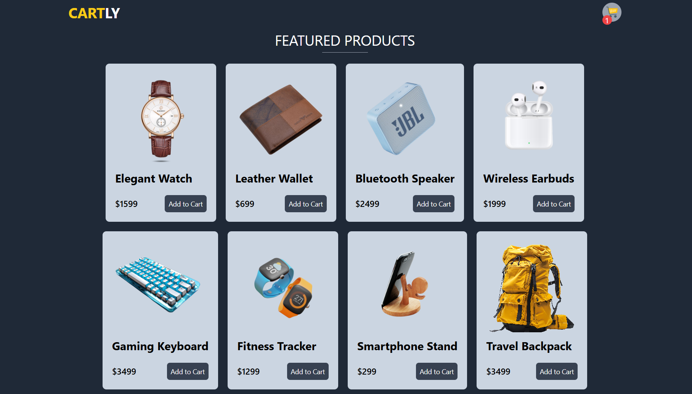
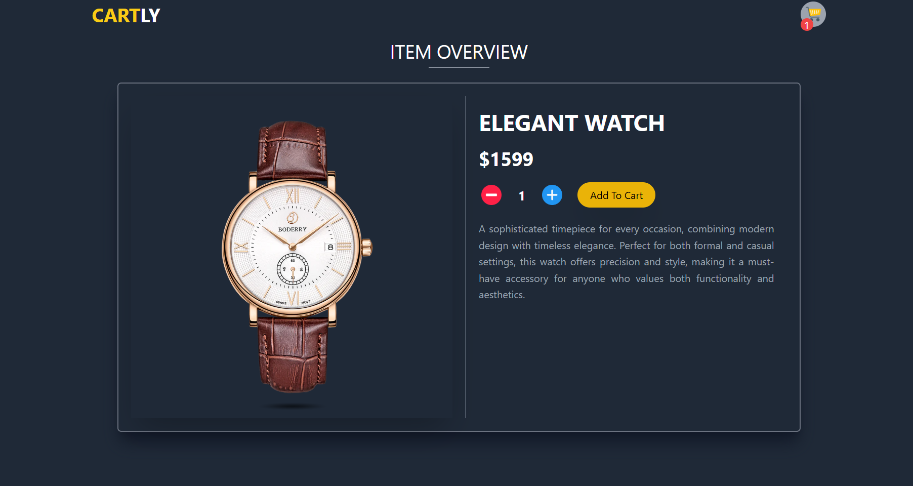
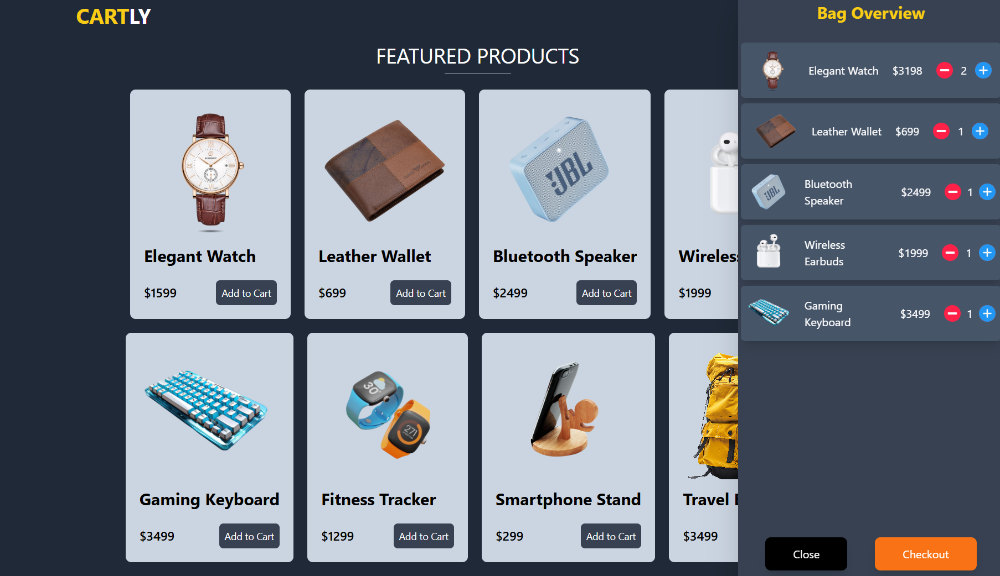

# **Cartly** 🛒✨  
Welcome to **Cartly**, your modern and responsive shopping cart application! Built with the power of **React.js** and styled effortlessly using **Tailwind CSS**, it ensures a seamless shopping experience.  

---

## 🌟 **Features You'll Love**  

- **📦 Browse Products**: Explore a stylish collection of products complete with images, names, and descriptions.  
- **🛍️ Add to Cart**: Effortlessly add your favorite items to the cart with a single click.  
- **🔄 Update Quantities**: Adjust the quantity of items in real time, ensuring just the right amount every time.  
- **🗑️ Remove Items**: Simplify your cart by removing unwanted items with ease.  
- **📱 Responsive Design**: Enjoy a flawless experience across all devices with Tailwind CSS-powered responsiveness.  

---

## 🛠️ **Tech Stack**  

- **⚛️ React.js**: The foundation for our dynamic and interactive frontend.  
- **🎨 Tailwind CSS**: Crafting elegant, responsive designs with utility-first principles.  
- **⚡ Vite** (optional): Lightning-fast development and build tool for an enhanced workflow.  

---

## 🚀 **Installation Guide**  

### **Prerequisites**  
Ensure you have the following installed on your system:  
- **Node.js** (v16 or later)  
- **npm** or **yarn**  

### **Steps to Get Started**  
1. **📂 Clone the Repository**:  
   ```bash  
   git clone https://github.com/SyedShahulAhmed/React-Projects.git  
   cd cartly  
   ```  

2. **📦 Install Dependencies**:  
   ```bash  
   npm install  
   ```  

3. **▶️ Start the Development Server**:  
   ```bash  
   npm run dev  
   ```  
   Open your browser and visit: **`http://localhost:3000`** 🎉  

---

## 📸 **Screenshots**  

### **🏠 Homepage**  
  

### **🛍️ Item Overview**  
  

### **📱 Mobile-Friendly Design**  
  

