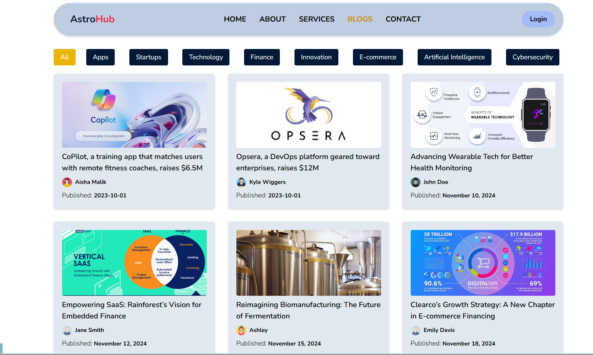

# 🌌 AstroHub Blog  

AstroHub Blog is a **responsive and user-friendly blogging website** created using **Vite**, **React**, and **Tailwind CSS**. It is designed to share content related to technology, programming, and artificial intelligence. Perfect for readers and writers passionate about exploring tech advancements. 🚀  

---

## 🌟 Features  

- 🖥️ **Responsive Design**: Optimized for mobile, tablet, and desktop devices.  
- 📰 **Dynamic Content**: Displays engaging blog posts with titles, descriptions, and featured images.  
- ⚙️ **Modern Tech Stack**: Built with React for a seamless user experience.  

---

## 📄 Pages  

- **🏠 Home**:  
  A welcoming landing page with a clean and interactive design.  
- **📖 About**:  
  Share details about the blog and its mission.  
- **🔧 Services**:  
  Highlight services or categories related to the blog content.  
- **✍️ Blog**:  
  A dynamic section displaying all blog posts with images, titles, and summaries.  
- **📞 Contact**:  
  A form for users to get in touch or leave feedback.  

---

## 🚀 Technologies Used  

- **Frontend**:  
  - ⚛️ React (using Vite for fast development)  
  - 🎨 Tailwind CSS for styling  

- **Other Tools**:  
  - ⭐ FontAwesome for icons  
  - ✍️ Google Fonts for typography  

---

## 🛠️ Setup and Installation  

1. Clone the repository:  
   ```bash
   git clone https://github.com/SyedShahulAhmed/React-Projects.git
   cd AstroHub-Blog
   ```  

2. Install dependencies:  
   ```bash
   npm install
   ```  

3. Start the development server:  
   ```bash
   npm run dev
   ```  

4. Open the application in your browser at the provided local URL.  

---

## 🎨 Screenshots  

### 🏠 Home Page:  
  

### 📖 About Page:  
  

### 📖 Services Page:  
  

### ✍️ Blog Page:  
  

### 📞 Contact Page:  
  


---

## 🤝 Contributing  

We welcome contributions! Feel free to:  
- 🐞 Report bugs  
- 💡 Submit feature requests  
- 🔄 Fork and create pull requests  


